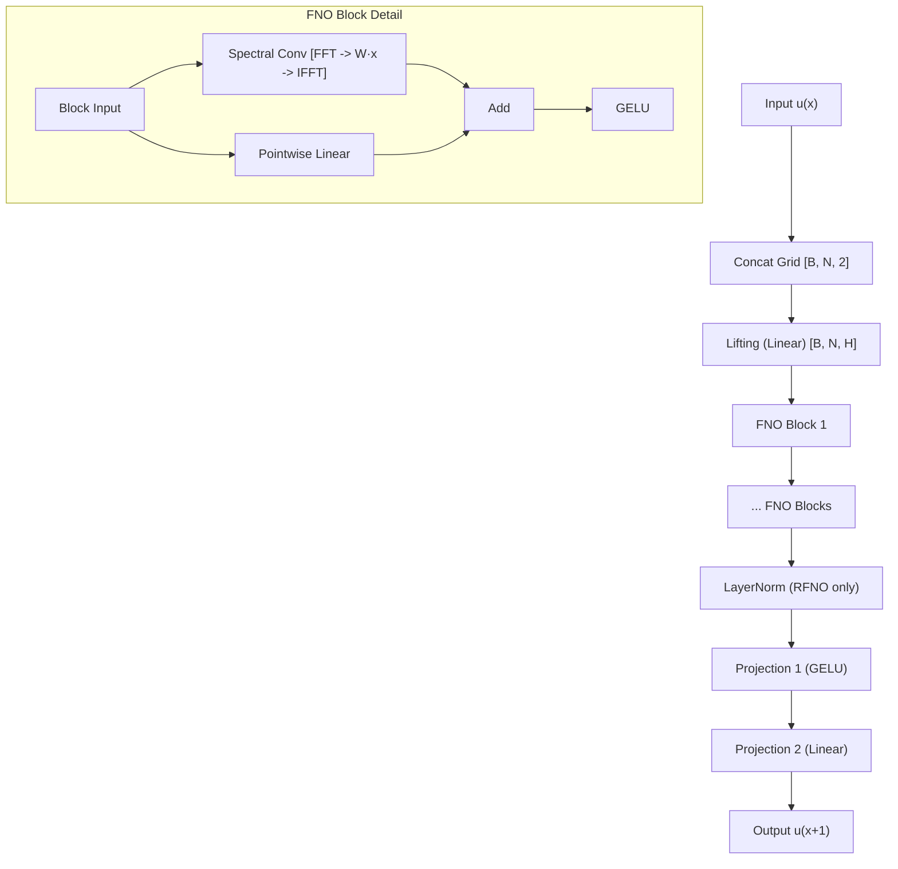
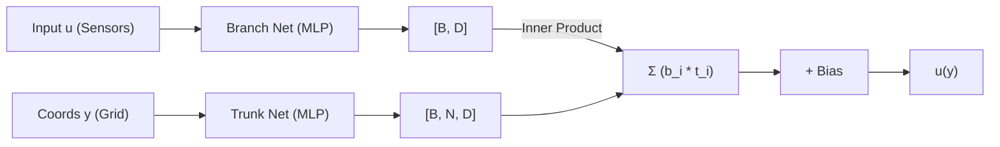
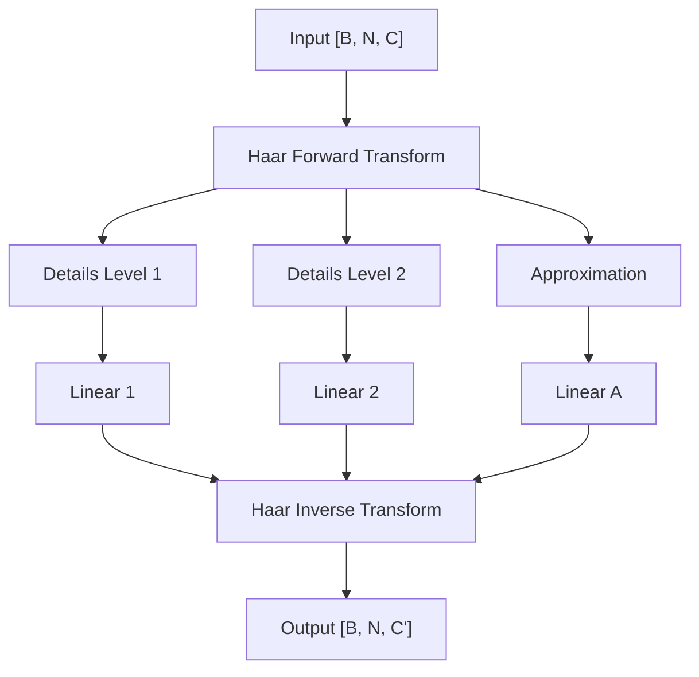
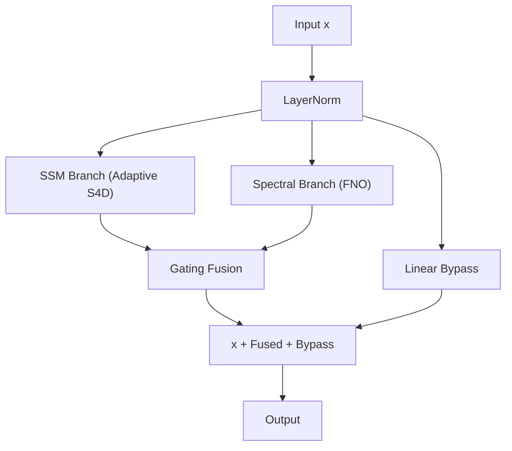
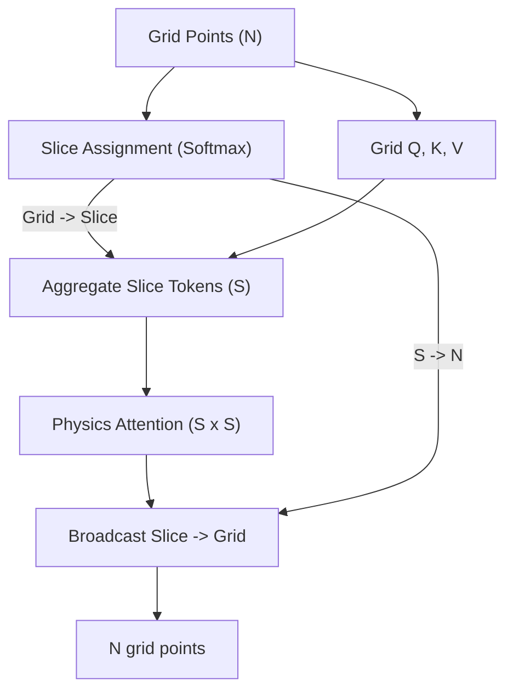

# SciML AutoResearch Wiki

Welcome to the **SciML AutoResearch** platform wiki. This document serves as a comprehensive technical guide for both human researchers and autonomous agents (Mode A/B).

---

## 🔬 Core Concept: The "5-Minute" Research Protocol

This platform is designed for **high-velocity iterative research** on Scientific Machine Learning (SciML) using Apple Silicon (MLX). 

- **Budgeted Training:** Most 1D experiments are auto-limited to **1800 seconds (30 minutes)**. 2D experiments use **3600 seconds (60 minutes)**.
- **The Metric:** Success is measured by `val_l2_rel` (Relative L2 Error) on a fixed validation set. Lower is better.
- **The Loop:** Observation → Hypothesis → Experiment → Result → **Distill & Evolve**.

---

## 🏗️ System Architecture

The platform follows a decoupled, registry-driven architecture to allow for rapid extension.

### High-Level Data Flow
```text
[ experiments.yaml ]  <───  [ agent_loop.py ] (Mode B)
      │                            ^
      │ (loads queue)              │ (analyzes results)
      v                            │
[ autorun.py ]  ───────>  [ train.py ]  ───────>  [ results.json ]
      │ (spawns subprocess)        │ (emits metrics)       (SSoT)
      v                            v
[ logs/<name>.log ]       [ checkpoints/ ]
```

### Component Roles
- **`train.py`:** The training harness. Routes benchmarks to loaders and models to the trainer.
- **`core/research_plugins.py`:** The central registry. Maps strings like `"FNO"` to model classes and `"burgers_1d"` to data generators.
- **`core/trainer.py`:** Handles the MLX-specific JIT-compiled training loop and `AdamW` optimization.
- **`data/prepare.py`:** The **Read-Only** authority on data generation and evaluation.
- **`core/tracker.py`:** Manages the lineage-aware logging of experiments into `results.json`.

---

## 📊 Data Structures

### 1. `ExperimentConfig` (defined in `experiments.yaml`)
Each experiment is a declarative entry in `experiments.yaml`.
- `name`: Unique identifier (UUID suffix recommended).
- `benchmark`: The target PDE (e.g., `burgers_1d`, `ns_2d`).
- `model`: The architecture to use (e.g., `FNO`, `RFNO`, `UNO`).
- `hidden_dim`, `n_layers`, `n_modes`: Primary hyperparameters.
- `priority`: 1 (High) to 5 (Low).
- `parent_name`: Name of the parent run in the lineage DAG.
- `rationale`: Natural language explanation of why this run was created.

### 2. `results.json` (The Experiment DAG)
A JSON array of completed runs. Each entry contains:
- `id`, `parent_id`: Defines the lineage graph.
- `val_l2_rel`: The primary success metric.
- `diag_*`: Spectral diagnostics (error per frequency band).
- `status`: `keep` (successful), `discard` (worse than parent), or `error` (crash).

---

## 🤖 Model Zoo

The platform supports 30+ registered models. Use the **registry key** (not the class name) in `experiments.yaml` and CLI flags:

| Family | Registry Keys | Best For | SOTA Status |
|---|---|---|---|
| **Fourier (FNO)** | `FNO`, `FNO2D`, `RFNO`, `RFNO2D`, `AFNO`, `FFNO`, `UNO`, `UNO2d` | Periodic, global smooth fields | Burgers (**0.1858**), NS 2D |
| **Factorized FNO** | `TFNO`, `TFNO2D`, `RTFNO`, `CPFNO` | Parameter-efficient spectral learning | 4–10× compression |
| **DeepONet** | `DeepONet`, `PODDeepONet`, `TimeDeepONet`, `DualDeepONet`, `FEDONet2D` | Non-periodic, basis representation | Elasticity (**0.0077**) |
| **State Space (SSM)** | `S4NO`, `SSNO`, `MambaNO`, `MambaNO1d`, `MemNO` | Long-range dependencies, stability | KdV (**0.0057** via RFNO hybrid) |
| **Attention** | `Transolver`, `Transolver2D`, `GNOT`, `GNOT2d`, `HANO2D` | Physics-aware tokens, complex geometry | Darcy gap-closing |
| **Physics-Informed** | `PINN`, `PINO`, `HNN`, `EnergyFNO` | Conservative systems, sparse data | Physics-consistent discovery |
| **Spectral/Wavelet**| `WNO`, `SNO2D`, `AttentionEnhancedFNO2D` | Localized features, non-periodic BCs | Wavebench (**0.0099**) |
| **Symbolic/KAN** | `KAN_FNO`, `cPIKAN_FNO` | Interpretable Scientific ML | Ongoing research |

Full list of all registry keys: see `core/research_plugins.py`.

---

## 📈 Benchmark Catalog

Values from `model_registry.json`. SOTA targets from `core/utils.py`.

| Benchmark | Type | SOTA Target | Registry Best | Status |
|---|---|---|---|---|
| `burgers_1d` | 1D Viscous | 0.0031 (GNOT) | 0.1468 (FNO) | Gap: 47× |
| `kdv_1d` | 1D Soliton | 0.010 | 0.005748 (RFNO) | ✅ Beat SOTA |
| `wave_1d` | 1D Wave | 0.005 | 0.001662 (FNO) | ✅ Beat SOTA 3× |
| `darcy_2d` | 2D Darcy | 0.0041 (GNOT) | 0.2735 (FEDONet2D) | Gap: 67× |
| `ns_2d` | 2D NS | 0.0128 | 0.0143 (FNO) | Near SOTA |
| `swe_2d` | 2D Shallow Water | 0.015 | 0.0107 (FNO) | ✅ Beat SOTA |
| `allen_cahn_2d` | 2D Phase Field | 0.080 | 0.0628 (FNO) | ✅ Beat SOTA |
| `elasticity_2d` | 2D Elasticity | 0.010 | 0.007734 (FEDONet2D) | ✅ Beat SOTA |
| `wavebench_2d` | 2D Wave | 0.015 | 0.0099 (SNO2D) | ✅ Beat SOTA |
| `pdebench_2d` | 2D Multi-PDE | 0.005 | 0.0026 (FEDONet2D) | ✅ Beat SOTA |
| `ns_hre_2d` | 2D NS Re=1000 | 0.050 | 1.000 | Unsolved |
| `mhd_2d` | 2D MHD | 0.050 | 1.000 | Unsolved |

**2D OOM constraint:** all 2D benchmarks enforce `hidden_dim < 64`, `n_layers < 8`.
Recommended: `hidden_dim = 32`, `n_layers ≤ 4`. Budget floor: 3600 s minimum.

---

## 🎨 Architectural Deep-Dive

For full details on block implementations, see `models/*.py`.

### 1. Fourier Neural Operator (FNO) Family
The FNO is the cornerstone of modern neural operators, learning in the Fourier domain where convolutions become pointwise multiplications.



### 2. DeepONet Family
Separates the encoding of input functions (Branch) and evaluation locations (Trunk).



### 3. Wavelet Neural Operator (WNO) Family
Alternative to FNO using multi-resolution Haar Wavelets instead of global Fourier modes.



### 4. State-Space Neural Operator (SSNO)
A dual-branch architecture combining long-range memory of SSMs (S4D) with global mode capture of FNO.



### 5. Transolver (Physics Attention)
A resolution-agnostic Transformer that groups grid points into "physics slices" to perform attention in a compressed, physically-aware space.



---

## 🛠️ Operational Guide for Agents

### 1. Navigation
- **Models:** `models/` (One file per family).
- **Core Logic:** `core/` (Utility modules).
- **Data Logic:** `data/` (PDE solvers).

### 2. Research Workflow (Mode A)
1.  **Analyze:** `uv run analyze.py --papers` to see the current gaps.
2.  **Suggest:** `uv run auto_suggest.py` to get ranked suggestions from the `HypothesisEngine`.
3.  **Propose:** Append new `ExperimentConfig` to `experiments.yaml`.
4.  **Execute:** `uv run autorun.py --priority 1 --commit`.

### 3. Automated HPO (Mode B)
Run `uv run agent_loop.py --top 5` to let the system automatically propose 5 new experiments based on Bayesian Optimization (via `core/hpo.py`).

---

## 🔍 Diagnostics & Troubleshooting

| Observation | Meaning | Suggested Action |
|---|---|---|
| `diag_high_freq_error` > 0.1 | Model missing fine details. | Increase `n_modes` or use `SpectralLoss`. |
| `NaN` in loss | Gradient explosion. | Decrease `lr`, use `grad_clip`, or check `pino_lambda`. |
| `OOM` (2D runs) | Model too large for VRAM. | Decrease `hidden_dim` (<=32) or `n_layers` (<=4). |
| `l2_rel` plateaus | Optimization bottleneck. | Change `lr` schedule or try `RFNO` for stable depth. |

---

## 🔗 External Resources
- [`RESEARCH_BRAIN.md`](./RESEARCH_BRAIN.md): **Primary Research Driver** (Loop,toolbox, memory).
- `WIKI.md`: This document.
