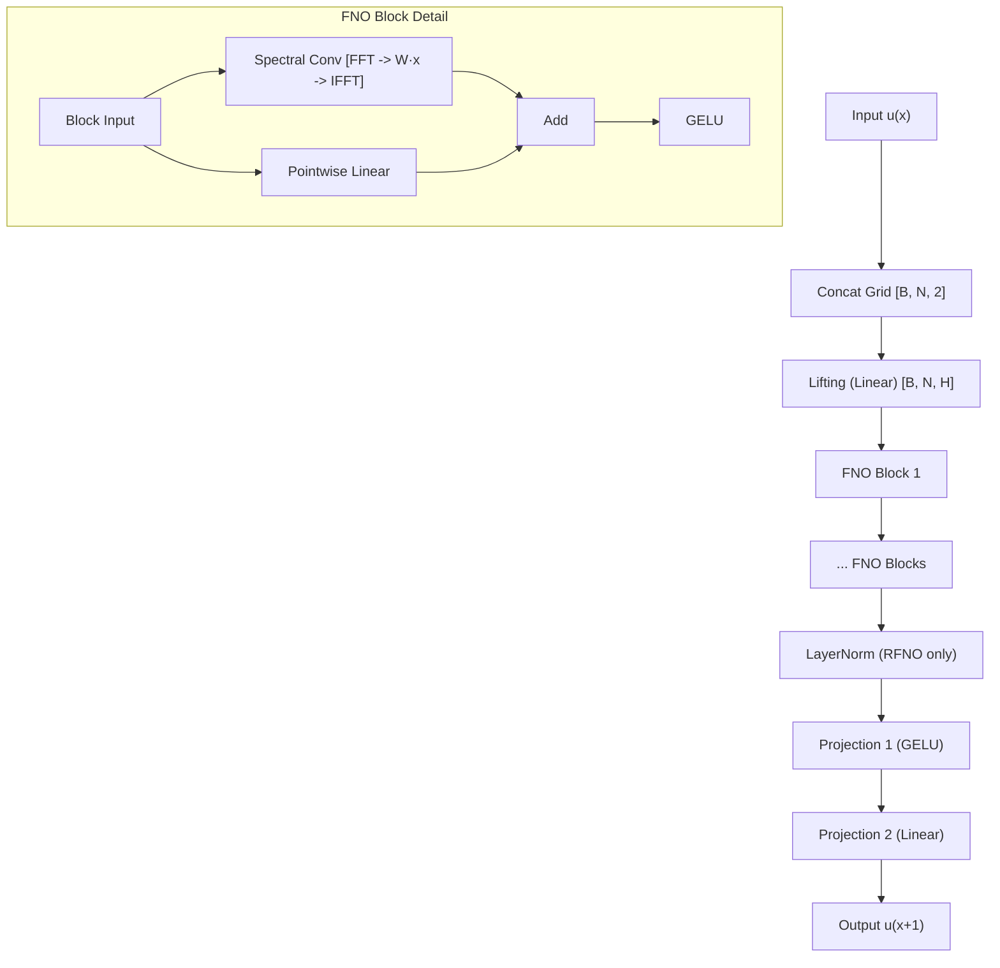
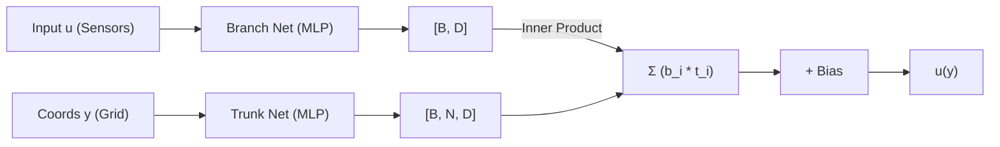
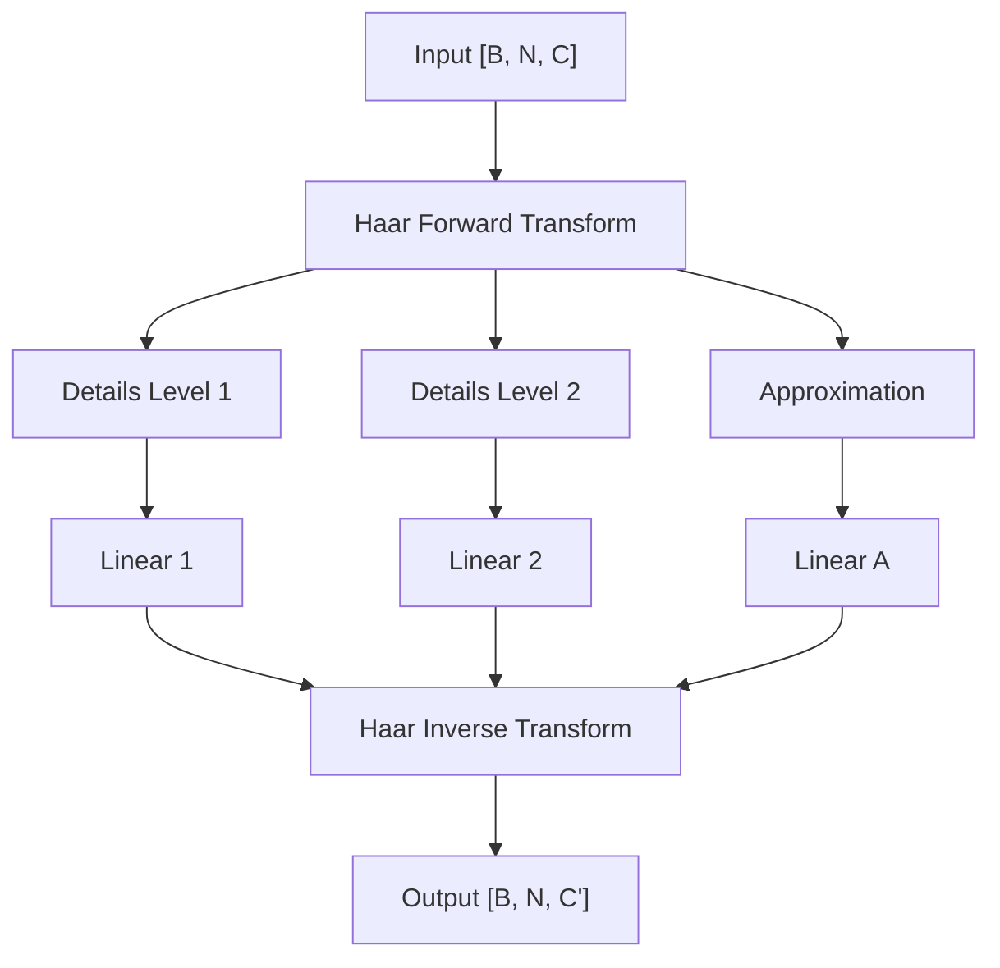
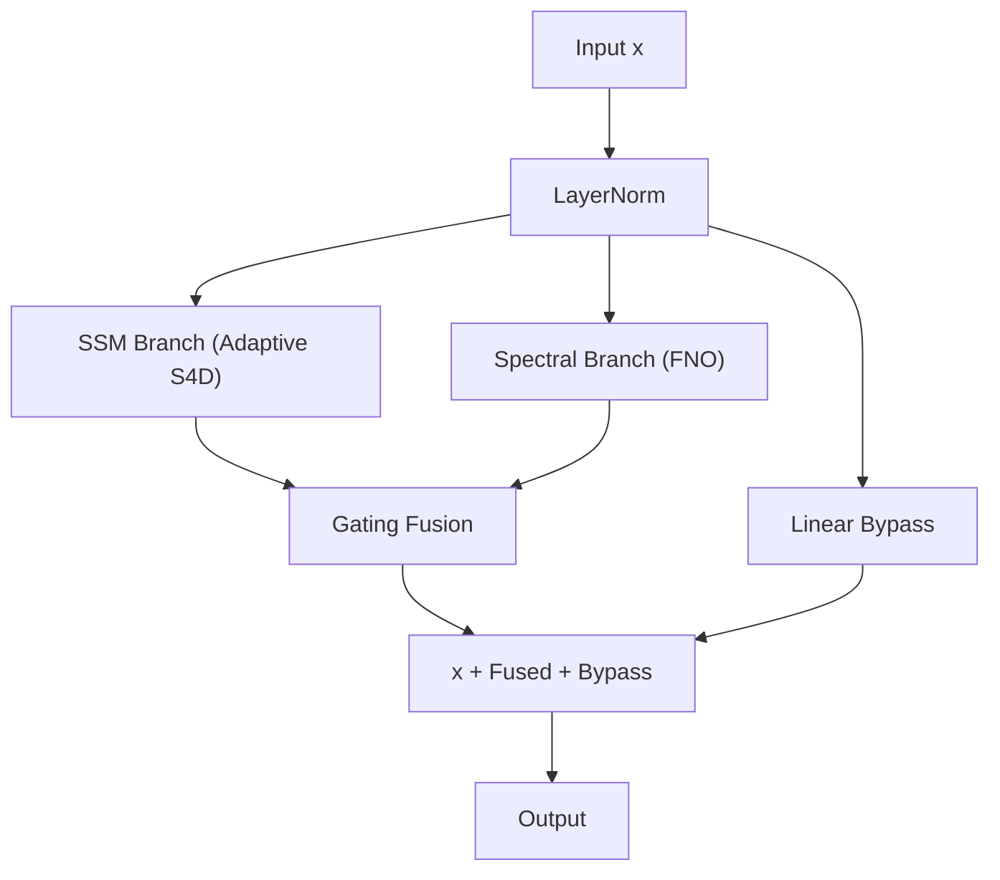
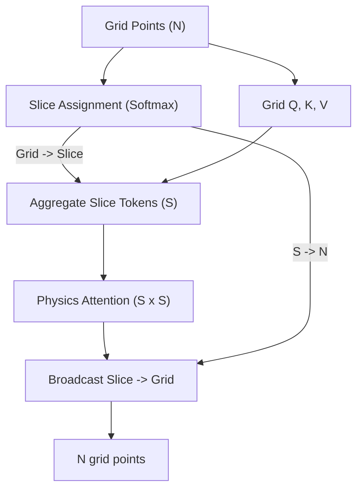

# SciML-AutoResearch: Model Architectures

This document provides a technical and visual guide to the neural operators implemented in this repository.

---

## 1. Fourier Neural Operator (FNO) Family
The FNO is the cornerstone of modern neural operators, learning in the Fourier domain where convolutions become pointwise multiplications.

````carousel

<!-- slide -->
### Variants
- **FNO1d/2d**: Standard global spectral convolution.
- **RFNO**: Residual FNO with Pre-LN connection ($x = x + \text{FNO}(x)$). Optimized for deep stacks ($l \geq 10$).
- **UNO1d**: U-shaped Neural Operator. Uses spectral subsampling for encoder-decoder structure with skip connections.
````

---

## 2. DeepONet Family
Based on the universal approximation theorem for operators, separating the encoding of input functions (Branch) and evaluation locations (Trunk).



---

## 3. Wavelet Neural Operator (WNO) Family
Alternative to FNO using multi-resolution Haar Wavelets instead of global Fourier modes. Better for non-periodic boundaries and sharp shocks.



---

## 4. State-Space Neural Operator (SSNO)
A cutting-edge dual-branch architecture combining the long-range memory of SSMs (S4D) with the global mode capture of FNO.



---

## 5. Transolver (Physics Attention)
A resolution-agnostic Transformer that groups grid points into "physics slices" to perform attention in a compressed, physically-aware space.



---

## 6. Factorized FNO (TFNO / CPFNO)
Memory-efficient FNO variants that factorize the large spectral weight tensor using Tucker or CP decomposition.

| Metric | FNO | TFNO (Tucker) | CPFNO (CP) |
| :--- | :--- | :--- | :--- |
| **Weight Shape** | $[M, I, O]$ | $G \times U_m \times U_i \times U_o$ | $\sum_r a_r \otimes b_r \otimes c_r$ |
| **Complexity** | $M \cdot I \cdot O$ | $R^3 + R(M+I+O)$ | $R(M+I+O)$ |
| **Reduction** | $1\times$ | $\sim 4-10\times$ | $\sim 100\times$ |

---

## 7. PINN / PINO
Physics-Informed models mapping coordinates directly to solution values, optionally conditioned on initial states.

- **PINN**: Coordinate-based MLP $u(x, t) \approx \text{NN}(x, t; \theta)$.
- **PINO**: Learns the operator mapping $u_0 \to u$ using the PINN backbone, often by concatenating $u_0$ values to the coordinate input.

---

## Technical Summary Table

| Model | Domain | Best For | SOTA Status |
| :--- | :--- | :--- | :--- |
| **FNO** | Fourier | Periodic, Global smooth | Burgers (0.14) |
| **RFNO** | Fourier | Deep models, Solitons | KdV (**0.0020**) |
| **SSNO** | Hybrid | Long-range, Multi-scale | Burgers target (0.007) |
| **WNO** | Wavelet | Non-periodic, Shocks | Localized features |
| **GNOT** | Spatial | Irregular grids, Transformers | General benchmarks |
| **DeepONet** | Dual | Basis representation | POD-based priors |
| **Transolver**| Physics-Attn| Large grids, Geometry | Physics-aware tokens |
